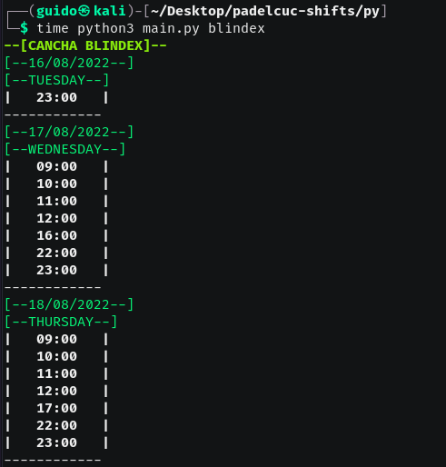

# padelcuc-shifts
# Purpouse
Optimize the data collection from the original website of CUC padel shifts. \
Created for personal purposes, with this `web-scrapper` we can check the available shifts (in a 4 day period) for the two Carmen de Areco's padel fields. 


# About
- You will notice that this repository has **two directories**: `go` and `py`, because i wanted to replicate the same code in two very different languages as Golang and Python to check some metrics, like the speed of execution, lines of code (being the same) , etc.
- If you enter into the original website , you will notice that obtaining the data from the available shifts, it's going to be a little slow compared with an algorithm.
    - [Cancha Blindex](https://darturnos.com/CanchasPadelCuc/4188)
    - [Cancha Cerrada](https://darturnos.com/CanchasPadelCuc/4189)


# Setup
1. **`git clone https://github.com/guidoenr/padelcuc-shifts`**
2. **`cd /py`** | **`cd /go`**
3. Install each language requirements, such as (e.g) `pip install requirements` or `go get main` 

# Usage
It is assumed that you have both Python and Golang installed, as well as several libraries, but in the future it will be migrated to Docker to avoid this.
## <ins>Golang</ins> [>v1.8]
- **`cd /padelcuc-shifts/go`**
- **`go run . -field={field}`**

Where the **`field`** flag could be `blindex` or `cerrada`

Example: `go run . -field=blindex`

## <ins>Python</ins> [>v2.9]

- **`cd /padelcucshifts/py`**
- **`python3 main.py {field}`**
- **Example**: `python3 main.py blindex`


# Output Example


# Metrics
## Python
```bash
real	0m1.123s
user	0m0.153s
sys	    0m0.000s
```

## Golang
```bash
real	0m1.108s
user	0m0.263s
sys	    0m0.085s
```
